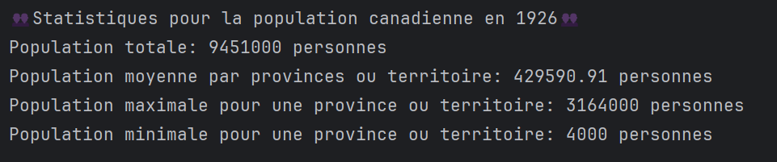
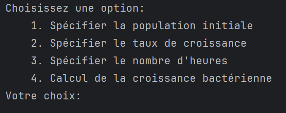
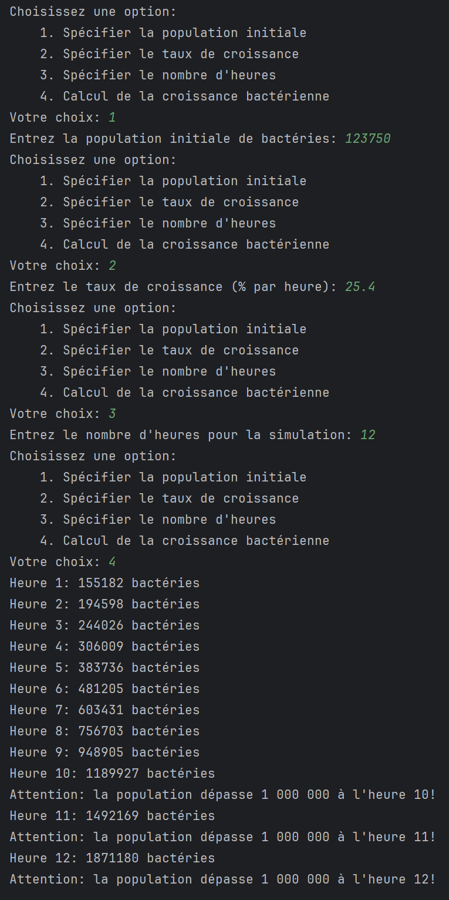

# Travail Pratique 1
Travail pratique 1 du cours 420-SF1-RE Automne 2026

## Sommaire
Le travail pratique 1 est divisé en 4 parties. Chaque partie est un problème à résoudre à part entière et doit être complétée dans le fichier spécifié dans les instructions. Les parties sont les suivantes:
1. Validation d'un mot de passe
2. Le code secret du pirate
3. Population du Canada en 1926
4. Croissance bactérienne

Ce travail pratique compte pour 15% de la note finale. Voir le barême de correction plus bas.

## Constitution des équipes et mise en place du TP
Ce travail s'effectue en équipe de 2 ou 3 personnes. Tout travail solo ne sera pas corrigé et se verra attribué la note de 0.

Une fois l'équipe créée, Classroom 50 va créer un dépôt Github pour les membres de l'équipe que vous pourrez accéder à partir de votre compte Github. Le lien du dépôt apparaît aussi dans Classroom 50.

- Chaque coéquipier peut cloner le dépôt pour travailler sur le TP.
- Écrivez votre code dans les fichiers appropriés
- N'oubliez pas d'inscrire vos noms et utilisateurs Github dans l'entête des fichiers.
- Faire un "commit" va créer une révision locale sur votre ordinateur.
- Le "push" permet d'envoyer les commits sur le serveur distant
  - Ceci veut dire que vous pouvez faire la remise au fur et à mesure.
    - Chaque "push" fait la remise de vos commits locaux
  - La correction se fera sur la version du code présente dans le dépôt au moment de l'échéance de la remise.
  - Pas de remise par LÉA

## Problèmes à résoudre

## Problème 1: Validation de mots de passe
Notions: str, boucles, conditions, fonctions, opérateurs, print, input

Le code doit être écrit dans le fichier ``validation.py``

- Écrire un programme qui, pour chaque mot de passe saisi sur une seule ligne, affiche ``OK`` s’il respecte toutes les règles ci-dessous, sinon affiche Faible.
  - Règles (toutes obligatoires)
    - Longueur ≥ 8
    - Contient au moins un chiffre (0–9)
    - Contient au moins une majuscule (A–Z)
    - Contient au moins une minuscule (a–z)
    - Contient au moins un caractère spécial parmi uniquement : ``-, =, @, $`` (tout autre caractère spécial ne compte pas pour cette règle)
    Dans le cas contraire, affichez ``Faible``.
  - Consignes d’entrée/sortie
    - Lire une seule ligne contenant plusieurs mots de passe, séparés par un unique espace (pas d’autres séparateurs).
    - Refuser toute ligne contenant des espaces multiples consécutifs ou des espaces en début/fin ; demander à l’utilisateur de ressaisir la ligne jusqu’à ce qu’elle soit conforme.
    - Afficher un résultat par ligne, dans le même ordre que les mots de passe en entrée.
  - Il est interdit d’utiliser des expressions régulières (regex).

## Problème 2: Le code secret du pirate
Notions: str, int, boucles, fonctions, opérateurs, conditions, print,

Le code doit être écrit dans le fichier ``code_pirate.py``

Un célèbre pirate est mort en laissant un coffre rempli de trésors. Pour l’ouvrir, il faut entrer un code secret à 3 chiffres caché dans une énigme. 
L’énigme :
  - Je suis un code à 3 chiffres ; tous mes chiffres sont différents.
  - La somme de mes trois chiffres est 18.
  - Mon deuxième chiffre est supérieur d’une unité au premier.
  - Mon troisième chiffre est supérieur de cinq au premier.
  - Le nombre à 3 chiffres est un multiple de 3.
  
Écrire un programme Python qui calcule le code et l’affiche.

### Problème 3: Population du Canada en 1926
Notions: str, int, boucles, fonctions, opérateurs, listes, print, formatage de chaîne

Le code doit être écrit dans le fichier ``population_1926.py``

Les données sont tirées de Statistique Canada: https://www150.statcan.gc.ca/t1/tbl1/en/tv.action?pid=3610028001

- Extraire la population de 1926 pour chaque province et territoire sans utiliser numpy ou pandas
  - Une liste de chaîne de caractères est fournie dans le fichier ``population_1926.py``
  - Chaque élément de la liste est une chaîne de caractères qui encode la population d'une province ou territoire pour les années 1926 et 1927
    - Le format est le suivant: ``année-province-population``
      - Exemple: ``"1926-Ontario-3164000"``, 3164000 personnes en Ontario en 1926
  - Vous devez extraire la population de 1926 pour chaque province et territoire
    - Vous devez extraire les données seulement pour l'année 1926
    - Vous devez convertir la population extraite en entier
- Vous devez calculer la population totale du Canada en 1926
- Vous devez faire la moyenne de la population des provinces et territoires en 1926
  - La moyenne doit être arrondie à deux décimales
- Vous devez trouver la plus grande population parmi les provinces et territoires en 1926 (seulement la population, pas le nom de la province ou territoire)
- Vous devez trouver la plus petite population parmi les provinces et territoires en 1926 (seulement la population, pas le nom de la province ou territoire)

- Afficher les résultats selon le format suivant:
   
  - L'émoji (bustes en silhouette) au début et à la fin de la première ligne est associé à la valeur unicode ``0001F465`` 

### Problème 4: Croissance bactérienne
Notions: str, int, float, boucles, fonctions, opérateurs, conditions, print, input

Le code doit être écrit dans le fichier ``croissance_bacterienne.py``

Écris un programme qui simule la croissance d'une population bactérienne. La population initiale, le taux de croissance (en % par heure) et la durée (en heures) sont fournis par l'utilisateur. Le programme doit afficher la population à chaque heure.

- Utiliser une fonction pour calculer la population à chaque heure.
- Utiliser une boucle pour afficher l'évolution de la population.
- Si la population dépasse 1 000 000 pour une heure donnée, afficher un message spécial
  - Exemple: ``Attention: la population dépasse 1 000 000 à l'heure 5!``
- Créer un menu pour permettre à l'utilisateur de choisir entre différentes options
  - Le menu doit reproduire l'affichage suivant: 
    
  - Le menu doit se répéter jusqu'à ce que l'utilisateur roule la simulation avec succès
  - Si l'utilisateur choisit une option invalide, afficher le message ``Option invalide. Veuillez réessayer.`` et redemander une option
  - Spécifier la population initiale
    - La population initiale doit être un entier positif
      - Si l'utilisateur entre une valeur invalide, afficher le message ``Valeur invalide. Veuillez entrer un entier positif.`` et redemander la population initiale.
  - Le taux de croissance
    - Le taux de croissance doit être un nombre flottant positif
      - Si l'utilisateur entre une valeur invalide, afficher le message ``Valeur invalide. Veuillez entrer un nombre flottant positif.`` et redemander le taux de croissance.
  - La durée
    - La durée doit être un entier positif
      - Si l'utilisateur entre une valeur invalide, afficher le message ``Valeur invalide. Veuillez entrer un entier positif.`` et redemander la durée.
  - Rouler la simulation
    - Si la population initiale, le taux de croissance ou la durée n'ont pas été spécifiés, afficher le message ``Erreur: Veuillez spécifier tous les paramètres avant de calculer la croissance.`` et redemander une option.
    - Calcul de la population à chaque heure
      - La formule pour calculer la population à chaque heure est la suivante:
        - ``population_heure_n = population_initiale * (1 + taux/100)``
          - ``n`` est le numéro de l'heure (de 1 à la durée spécifiée)
          - ``population_initiale`` est la population au début de l'heure (pour l'heure 1, c'est la population initiale spécifiée par l'utilisateur); pour les heures suivantes, la population initiale est le résultat de la population à la fin de l'heure précédente (population_heure_n)
          - ``taux`` est le taux de croissance en pourcentage
          - ``population_heure_n`` est la population à la fin de l'heure n

- Le calcul de la population à chaque heure doit être implémenté dans une fonction nommée ``croissance_population(pop_init: int, taux: float, heures: int)``
- L'affichage de la population à chaque heure doit être formaté comme suit: 
  - Heure {no de l'heure}: {population} bactéries
    - Exemple: ``Heure 1: 1500 bactéries``
  - La population doit être arrondie au plancher (int ou floor)

- Voici une exemple d'exécution du programme:
  

## Barême de correction!
- Chaque problème compte pour 25% du TP
- Pour chaque exercice, la correction se décline comme suit:
  - 50% Fonctionnement du code
    - Votre code va être testé avec plusieurs valeurs d'entrée. Si certaines réponses ne sont pas valides, vous allez perdre des points. En revanche, si votre code fonctionne à merveille, vous allez avoir tous vos points! Je vous conseille de bien tester votre programme
  - 10% Commentaires
    - Avez-vous mis suffisamment de commentaires ? Vous devez en mettre quelques-uns à des endroits clés, de façon à expliquer le fonctionnement global du programme. Attention : si vous mettez trop de commentaires, vous n'allez pas avoir tous vos points dans cette section.
  - 10% pour le respect des affichages demandés
  - 40% Beauté du code
    - Plus votre code est simple et facile à lire, plus vous allez avoir de points ! Voici des éléments qui contribuent à la beauté d'un code :
      - Est-ce que vos noms de variable sont descriptifs de leur utilisation ?
      - Est-ce que vous aérez vos expressions ?
        - Utilisez-vous des variables inutiles ? Évitez-vous la répétition de code ?
      - Est-ce que votre code est concis ?
      - Respectez-vous les [PEP-008](https://peps.python.org/pep-0008/)
        - PyCharm vous affiche des lignes jaunes brisées si les PEP-0008 ne sont pas respectés
          - ex: 
            - trop de lignes vides ou pas assez lignes vides entre les blocs de code
            - respecter la convention de nommage des fonctions (snake_case)
            - la position des imports dans le fichier
          - PyCharm vous propose de les corriger pour vous si vous survoler la ligne jaune brisée 
      - Votre code est-il facilement adaptable à d'autres situations ?
- L'utilisation de tout IA est formellement interdite.